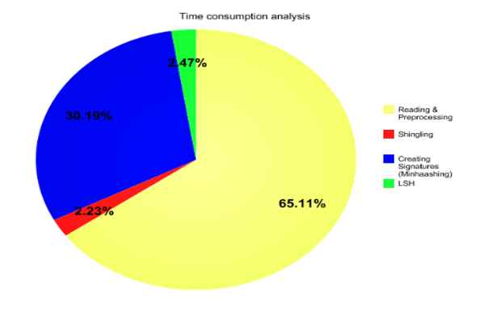

# Conference-Paper-Recommendation-System-using-LSH

Recommender systems help the users to get personalized recommendations and redefine the users web browsing experience. \
For large data, a faster and scalable algorithm is required. \
Hence, Locality Sensitive Hashing (LSH) is used as a criterion to find the similarity between conference papers. 

Dataset source: https://www.kaggle.com/paultimothymooney/cvpr-2019-papers 

#### Preprocessing Steps:
- 1. Lowercase all text.
- 2. Remove all digits.
- 3. Remove all punctuations.
- 4. Removing stop words.
- 5.  Lemmatization (Stemming).

#### Implementation

- 1. Reading the document data as a single dictionary
- 2. Converting the document into a set of k-shingles
- 3. Generate Minhash Signatures
- 4. Compute True Jaccard Similarity and find top-n similar documents.
- 5.  Compute Estimated Jaccard Similarity using the Signature Matrix and find top-n similar documents.
- 6. Compare the recommendations provided by True and estimated Jaccard Similarity.
- 7. In LSH, we find  appropriate b and r values to find most similar pair of documents.
- 8. Obtain TP and FP values to evaluate LSH.

 \
 \

